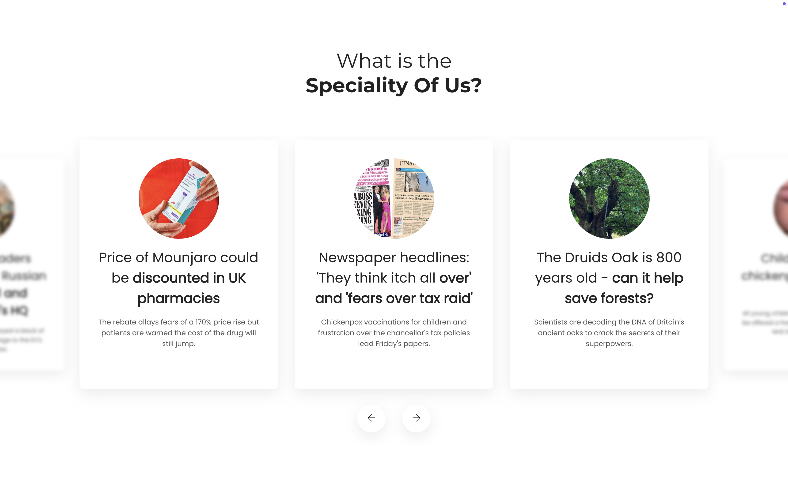

# Shokworks Technical Assessment - News Carousel

This repository contains the source code for the technical assessment, which consists of a responsive and interactive news carousel.

## Table of Contents

- [Table of Contents | Tabla de Contenido](#table-of-contents)
- [Screenshots | Capturas de pantalla](#screenshots)
- [English Version | Versión en Inglés](#english-version)
- [Spanish Version | Versión en Español](#spanish-version)
- [Original Next.js README | README Original de Next.js](#original-nextjs-readme)

<details open>
<summary><strong>Screenshots | Capturas de pantalla</strong></summary>

### Mobile


### Tablet


### Desktop



</details>

<br/>

<details open>
<summary><strong>English Version | Versión en Inglés</strong></summary>

---

### News Carousel - Shokworks Technical Assessment

This project is a technical assessment that involves the development of an interactive and responsive carousel component, built with Next.js 15 (App Router) and TypeScript.

The carousel displays the latest news from the BBC, consuming real-time data from the [News API](https://newsapi.org). The design is fully responsive, adapting to mobile devices, tablets, and desktops, using CSS Modules for an encapsulated and maintainable styling approach.

---

### Key Features

- **Real API Consumption:** Cards are dynamically generated from data fetched from the News API.
- **Responsive Design:** The user experience is optimal on any screen size, from small mobile devices to large desktops.
- **Fluid Animations:** Clean, 2D transitions for a pleasant navigation experience.
- **Modern Stack:** Built with Next.js 15, React 19, and TypeScript, following the ecosystem's best practices.
- **Styling with CSS Modules:** Organized, modular, and collision-free CSS code.

---

### Local Installation and Execution

Follow these steps to run the project on your local machine.

#### 1. Prerequisites

- [Node.js](https://nodejs.org/en) (version 20.x or higher)
- [npm](https://www.npmjs.com/)
- A [News API](https://newsapi.org/register) Key

#### 2. Clone the Repository

Choose one of the following `<REPOSITORY_URL>` options for cloning the repository with Git:
```bash
ssh: git@github.com:alessandrror/shokworks-technical-assessment.git
https: https://github.com/alessandrror/shokworks-technical-assessment.git
```

Run the following command:
```bash
git clone <REPOSITORY_URL>
cd shokworks-technical-assessment
```

#### 3. Install Dependencies

The project uses `npm` for package management. Run the following command to install the dependencies:

```bash
npm install
```

#### 4. Set Up Environment Variables

You need a News API Key for the application to fetch data. Create a file named `.env.local` in the project root and add your key:

```
NEWS_API_KEY=YOUR_API_KEY_HERE
```

> **Note:** The `.env.local` file is included in the `.gitignore` to prevent secret keys from being uploaded to the repository.

#### 5. Run the Development Server

Once the installation and setup are complete, start the development server with Turbopack:

```bash
npm run dev
```

Open [http://localhost:3000](http://localhost:3000) in your browser to see the result.

</details>

<details open>
<summary><strong>Spanish Version | Versión en Español</strong></summary>

---

### Carrusel de Noticias - Shokworks Technical Assessment

Este proyecto es una evaluación técnica que consiste en el desarrollo de un componente de carrusel interactivo y responsivo, construido con Next.js 15 (App Router) y TypeScript.

El carrusel muestra las últimas noticias de la BBC, consumiendo datos en tiempo real desde la [News API](https://newsapi.org). El diseño es completamente responsivo y se adapta a dispositivos móviles, tablets y de escritorio, utilizando CSS Modules para un estilo encapsulado y mantenible.

---

### Características Principales

- **Consumo de API Real:** Las tarjetas se generan dinámicamente a partir de los datos obtenidos de News API.
- **Diseño Responsivo:** La experiencia de usuario es óptima en cualquier tamaño de pantalla, desde móviles pequeños hasta escritorios grandes.
- **Animaciones Fluidas:** Transiciones limpias y en 2D para una navegación agradable.
- **Estructura Moderna:** Construido con Next.js 15, React 19 y TypeScript, siguiendo las mejores prácticas del ecosistema.
- **Estilo con CSS Modules:** Código CSS organizado, modular y sin colisiones de clases.

---

### Instalación y Ejecución Local

Sigue estos pasos para ejecutar el proyecto en tu máquina local.

#### 1. Prerrequisitos

- [Node.js](https://nodejs.org/en) (versión 20.x o superior)
- [npm](https://www.npmjs.com/)
- Una API Key de [News API](https://newsapi.org/register)

#### 2. Clonar el Repositorio

Escoge una de las siguientes opciones de `<REPOSITORY_URL>` para clonar el repositorio con Git:

```bash
ssh: git@github.com:alessandrror/shokworks-technical-assessment.git
https: https://github.com/alessandrror/shokworks-technical-assessment.git
```

Ejecuta el siguiente comando:
```bash
git clone <URL_DEL_REPOSITORIO>
cd shokworks-technical-assessment
```

#### 3. Instalar Dependencias

El proyecto utiliza `npm` para la gestión de paquetes. Ejecuta el siguiente comando para instalar las dependencias:

```bash
npm install
```

#### 4. Configurar Variables de Entorno

Necesitas una API Key de News API para que la aplicación pueda obtener los datos. Crea un archivo llamado `.env.local` en la raíz del proyecto y añade tu clave:

```
NEWS_API_KEY=TU_API_KEY_AQUI
```

> **Nota:** El archivo `.env.local` está incluido en el `.gitignore` para evitar que las claves secretas se suban al repositorio.

#### 5. Ejecutar el Servidor de Desarrollo

Una vez completada la instalación y configuración, inicia el servidor de desarrollo con Turbopack:

```bash
npm run dev
```

Abre [http://localhost:3000](http://localhost:3000) en tu navegador para ver el resultado.

</details>

<details>
<summary><strong>Original Next.js README | README Original de Next.js</strong></summary>

---

This is a [Next.js](https://nextjs.org) project bootstrapped with [`create-next-app`](https://nextjs.org/docs/app/api-reference/cli/create-next-app).

## Getting Started

First, run the development server:

```bash
npm run dev
# or
yarn dev
# or
pnpm dev
# or
bun dev
```

Open [http://localhost:3000](http://localhost:3000) with your browser to see the result.

You can start editing the page by modifying `app/page.tsx`. The page auto-updates as you edit the file.

This project uses [`next/font`](https://nextjs.org/docs/app/building-your-application/optimizing/fonts) to automatically optimize and load [Geist](https://vercel.com/font), a new font family for Vercel.

## Learn More

To learn more about Next.js, take a look at the following resources:

- [Next.js Documentation](https://nextjs.org/docs) - learn about Next.js features and API.
- [Learn Next.js](https://nextjs.org/learn) - an interactive Next.js tutorial.

You can check out [the Next.js GitHub repository](https://github.com/vercel/next.js) - your feedback and contributions are welcome!

## Deploy on Vercel

The easiest way to deploy your Next.js app is to use the [Vercel Platform](https://vercel.com/new?utm_medium=default-template&filter=next.js&utm_source=create-next-app&utm_campaign=create-next-app-readme) from the creators of Next.js.

Check out our [Next.js deployment documentation](https://nextjs.org/docs/app/building-your-application/deploying) for more details.

</details>
